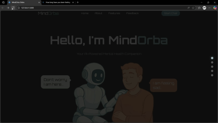

# 🧠 MindOrba – Mental Health Chatbot  

**MindOrba** is a conversational AI chatbot built with **Python (Flask)**, using **JSON** for lightweight data storage and **Ollama** for natural language processing.  
It’s designed to support mental well-being through empathetic conversations, mood tracking, and persona-driven interactions.  
---


[▶️ Click here to watch full demo](assets/demo.mp4)

---

## ✨ Features  
- 🔐 **User Authentication** – login, logout, and account management  
- 📊 **Mood Tracking** – record and view mood history  
- 🎭 **Persona Selection** – interact with different chatbot personalities  
- 💬 **Conversation History** – store and review past chats  
- 📂 **Data Export** – download personal mood and chat data  

---

## 🛠️ Tech Stack  
- **Language:** Python 🐍  
- **Framework:** Flask 🌐  
- **Database:** JSON 📄  
- **AI/NLP:** Ollama 🤖  

---

## 🚀 Getting Started  

```bash
# Clone the repo
git clone https://github.com/deept-369/Mental-Health-Chatbot-MindOrba.git

# Navigate into project
cd Mental-Health-Chatbot-MindOrba

# Install dependencies
pip install -r requirements.txt

# Run the app
python app.py
